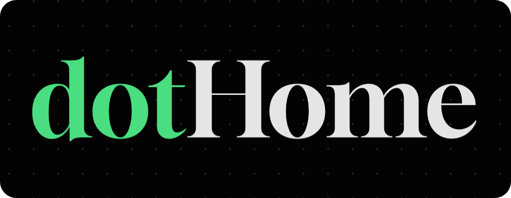
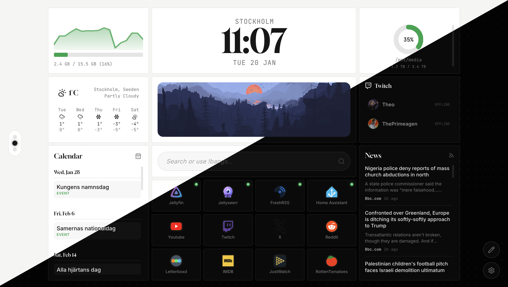
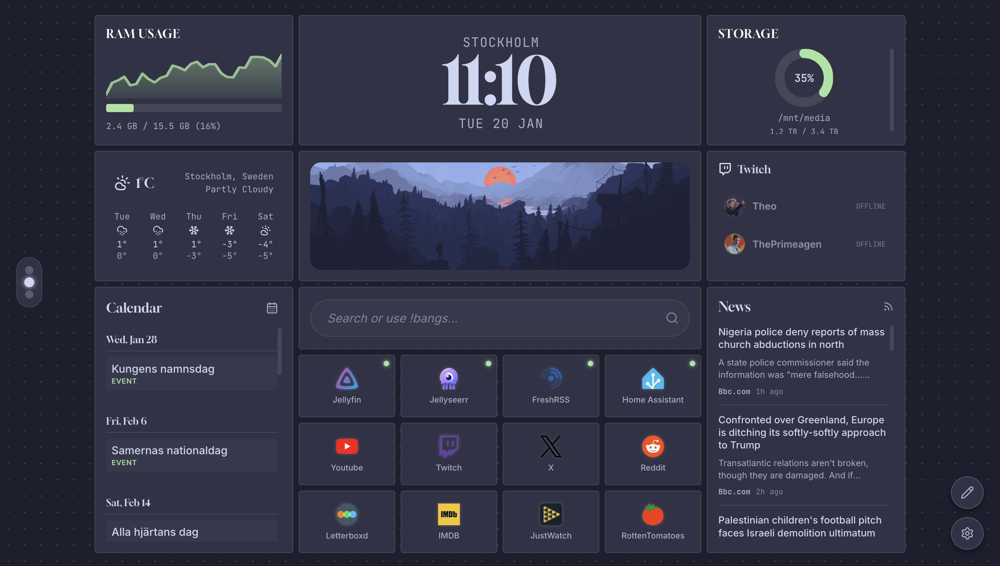
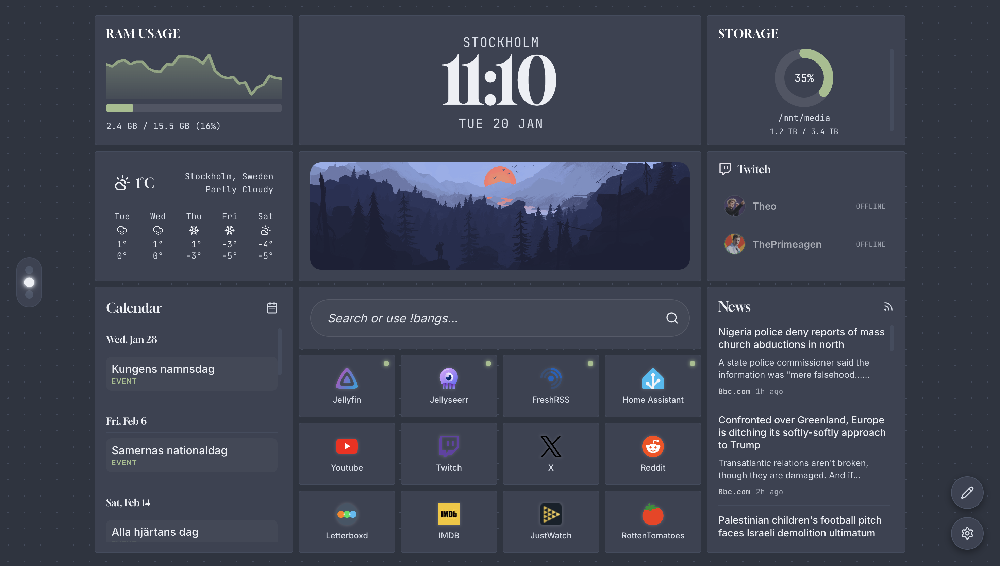
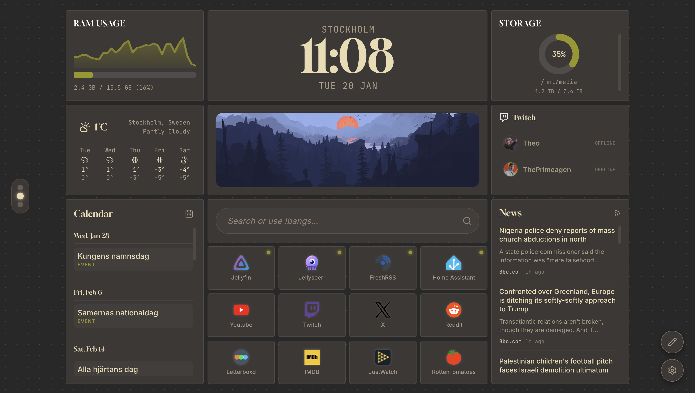
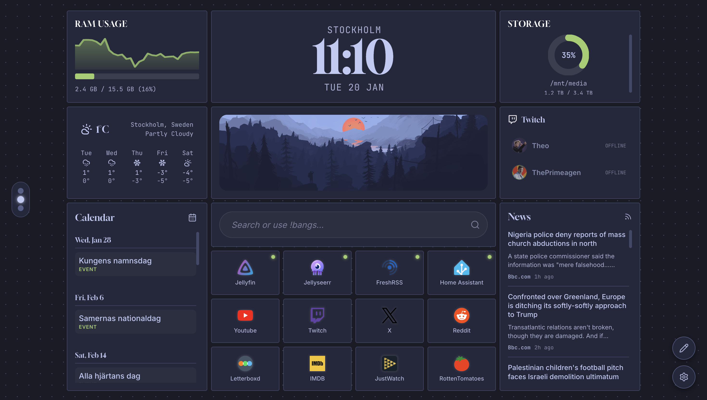
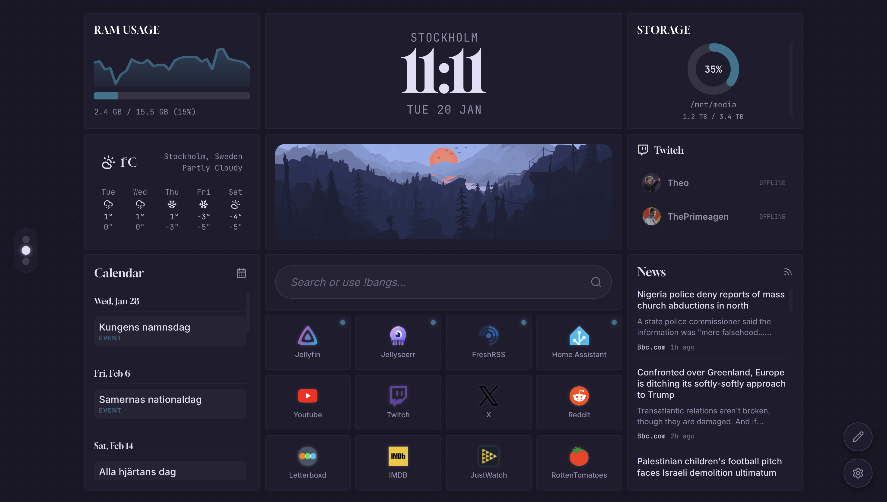
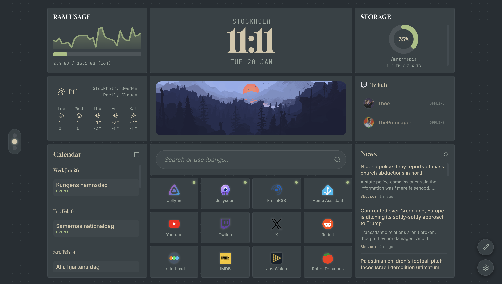

<p align="center">
  
</p>

<p align="center">
  <strong>A self-hosted dashboard for your homelab with arr-stack integrations</strong>
</p>

<p align="center">
  <a href="https://www.gnu.org/licenses/agpl-3.0">
    
  </a>
  <a href="https://github.com/TimKankse/dot-home">
    
  </a>
  <a href="https://github.com/TimKankse/dot-home">
    
  </a>
  <a href="https://github.com/TimKankse/dot-home">
    
  </a>
  <a href="docs/README.md">
    
  </a>
</p>

<br>

<p align="center">
  
</p>

<br>

---

## Overview

**dotHome** is built for homelab enthusiasts who want a nice looking, functional, and simple interface for their self-hosted services. 

<br>

## Features

### Dashboard Experience

| Feature | Description |
|:--------|:------------|
| **Bento Grid Layout** | Drag-and-drop widgets with fluid, responsive design |
| **Multi-Page Support** | Organize widgets across multiple pages with scroll navigation |
| **Keyboard Shortcuts** | Full keyboard navigation for power users |
| **Theme Support** | 8 built-in themes with light and dark variants |

### Integration Widgets

| Widget | Description |
|:-------|:------------|
| **Jellyfin** | Now Playing & Libraries |
| **Jellyseerr** | Request management |
| **Portainer** | Container status |
| **Netdata** | CPU, RAM, GPU, Network |
| **Twitch** | Live stream status |
| **qBittorrent** | Download queue |
| **SABnzbd** | Usenet downloads |

### Miscellaneous Widgets

| Widget | Description |
|:-------|:------------|
| **Clock** | Digital & analog with custom formats |
| **Weather** | Current, daily, or weekly forecasts |
| **Calendar** | iCal + Radarr/Sonarr releases |
| **Search** | Quick search with custom engines |
| **RSS** | Feed reader with thumbnails |
| **Image** | Display any image from URL |
| **Shortcuts** | Quick links to services |

### Integrations

Configure your services once, use them across multiple widgets:

```
Jellyfin • Radarr • Sonarr • Portainer • Netdata • Generic API
```

<br>

---

## Quick Start

### Docker Run (Recommended)

Get started instantly with a single command:

```bash
docker run -d \
  -p 9292:9292 \
  -v $(pwd)/.config:/app/config \
  --name dot-home \
  ghcr.io/timkankse/dot-home:latest
```

Access your dashboard at **[http://localhost:9292](http://localhost:9292)**.

### Docker Compose

Create a `docker-compose.yml` file:

```yaml
services:
  dot-home:
    image: ghcr.io/timkankse/dot-home:latest
    container_name: dot-home
    restart: unless-stopped
    ports:
      - "9292:9292"
    volumes:
      - ./.config:/app/config
```

Run with `docker compose up -d`.

### Manual Installation (Development)

```bash
# Clone the repository
git clone https://github.com/TimKankse/dot-home.git
cd dot-home

# Install dependencies
npm install

# Start development server
npm run dev
```

<br>

---

## Configuration

All configuration is stored in a SQLite database located at `/app/config/dothome.db` inside the container.
Using the volume mapping `-v $(pwd)/.config:/app/config` ensures your data persists in your local `.config` directory.

### Environment Variables

| Variable | Default | Description |
|:---------|:--------|:------------|
| `NODE_ENV` | `production` | Node environment |
| `PORT` | `9292` | Server port |

<br>

---

## Themes

dotHome includes **8 carefully crafted themes**:

<table>
<tr>
<td align="center" width="33%">
<br>
<strong>Catppuccin</strong>
</td>
<td align="center" width="33%">
<br>
<strong>Nord</strong>
</td>
<td align="center" width="33%">
<br>
<strong>Gruvbox</strong>
</td>
</tr>
<tr>
<td align="center">
<br>
<strong>Tokyo Night</strong>
</td>
<td align="center">
<br>
<strong>Rose Pine</strong>
</td>
<td align="center">
<br>
<strong>Everforest</strong>
</td>
</tr>
</table>

<p align="center"><em>Plus <strong>Dark</strong> and <strong>Light</strong> themes included</em></p>

> Change themes in **Settings > Appearance**

<br>

---

## Development

```bash
# Install dependencies
npm install

# Start development server
npm run dev

# Run linting
npm run lint

# Build for production
npm run build
```

### Tech Stack

| Layer | Technology |
|:------|:-----------|
| **Framework** | Next.js 15+ (App Router) |
| **Language** | TypeScript |
| **Styling** | CSS Modules + CSS Variables |
| **State** | Zustand |
| **Grid** | GridStack |
| **Database** | SQLite + Prisma |

<br>

---

## Contributing

Contributions are welcome! Please feel free to submit a Pull Request.

> [!NOTE]
> This is my first open source project, so I'm still learning and getting the hang of maintaining a GitHub repository. Feedback is appreciated!

<br>

---

## License

AGPL-3.0 License — see [LICENSE](LICENSE) for details.

<br>

---

## Acknowledgments

- Design inspired by **Nothing OS** and **Homarr**
- Icons compiled by the **Homarr team**
- Additional icons from [Lucide](https://lucide.dev)
- Fonts: **Gloock**, **Inter**, **Space Mono**

> [!NOTE]
> Generative AI was used as a tool to generate code for this project. No AI was used to generate images or other graphic assets.

<br>

<p align="center">
  
</p>

<p align="center">
  <sub>Built for the homelab community</sub>
</p>
