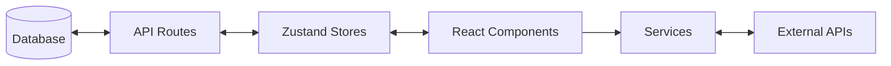

# Documentation Index

Welcome to the dotHome technical documentation.

## System Documentation

| Document | Description |
|----------|-------------|
| [Database](./database.md) | Prisma schema, models, and access control |
| [Grid](./grid.md) | GridStack layout system and responsive breakpoints |
| [Widgets](./widgets/README.md) | Widget architecture and available widgets |
| [State Management](./state-management.md) | Zustand stores and data flow |
| [Services](./services.md) | External API integration layer |
| [Authentication](./authentication.md) | Session management and permissions |
| [Primitives](./primitives.md) | Reusable UI component library |

---

## Quick Reference

### Tech Stack
- **Framework:** Next.js 16 (App Router)
- **Database:** SQLite + Prisma ORM
- **State:** Zustand
- **Grid:** GridStack.js
- **Styling:** CSS Modules

### Key Directories
```
src/
├── app/          # Next.js app router pages and API routes
├── components/
│   ├── core/     # DashboardGrid, WidgetRenderer, WidgetWrapper
│   ├── widgets/  # All widget components
│   └── settings/ # Settings panel components
├── store/        # Zustand state stores
├── services/     # External API integrations
├── types/        # TypeScript definitions
└── gridstack-react/  # GridStack React bindings
```

### Data Flow

