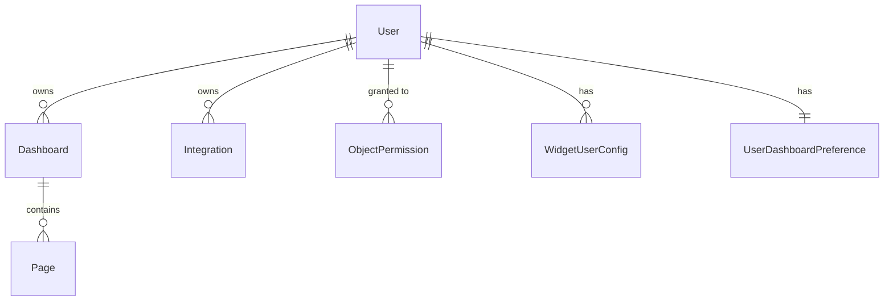

# Database System

The application uses **SQLite** with **Prisma ORM** for data persistence.

## Schema Overview

The database schema (`prisma/schema.prisma`) defines 9 models organized into core data, permissions, and preferences.

---

## Core Models

### User
Primary entity for authentication and ownership.

| Field | Type | Description |
|-------|------|-------------|
| `id` | String | CUID primary key |
| `email` | String | Unique email |
| `displayName` | String? | Optional display name |
| `passwordHash` | String | Hashed password |
| `role` | String | `"admin"` \| `"member"` \| `"viewer"` |

### Dashboard
Container for pages and widgets.

| Field | Type | Description |
|-------|------|-------------|
| `id` | String | CUID primary key |
| `userId` | String | Owner reference |
| `name` | String | Dashboard name (default: "Main") |
| `layout` | String | JSON blob containing widget configurations |
| `isDefault` | Boolean | Whether this is the user's default dashboard |
| `accessLevel` | String | `"PUBLIC"` \| `"VIEWABLE"` \| `"PRIVATE"` |

### Page
Organizes widgets within a dashboard.

| Field | Type | Description |
|-------|------|-------------|
| `id` | String | CUID primary key |
| `dashboardId` | String | Parent dashboard reference |
| `name` | String | Page name (default: "Page") |
| `sortOrder` | Int | Ordering within dashboard |
| `accessLevel` | String | Access control level |

### Integration
Stores connection details for external services.

| Field | Type | Description |
|-------|------|-------------|
| `id` | String | CUID primary key |
| `userId` | String | Owner reference |
| `name` | String | Display name |
| `type` | String | Service type (jellyfin, radarr, etc.) |
| `config` | String | JSON blob with URL, API key, etc. |
| `accessLevel` | String | Access control level |

---

## Permission Models

### Access Levels
Applied to Dashboard, Page, and Integration:

| Level | Description |
|-------|-------------|
| `PUBLIC` | Anyone can view AND edit |
| `VIEWABLE` | Anyone can view, only owner can edit |
| `PRIVATE` | Only owner can view and edit (default) |

### ObjectPermission
Per-user overrides for any object.

| Permission | Description |
|------------|-------------|
| `BLOCKED` | Cannot access at all (overrides PUBLIC) |
| `VIEW` | Can view (overrides PRIVATE) |
| `EDIT` | Full access (overrides everything) |

### WidgetUserConfig
Stores per-user widget configurations for non-synced widgets.

### WidgetPermission
Role-based access to widget types (e.g., only admins can use certain widgets).

---

## User Preferences

### UserDashboardPreference
Allows users to set any accessible dashboard as their default, even if they don't own it.

---

## API Integration

The database is accessed through Prisma Client via server-side API routes:

- `GET /api/config` - Fetches dashboard layout, widgets, pages, and settings
- `POST /api/config` - Saves dashboard state back to database
