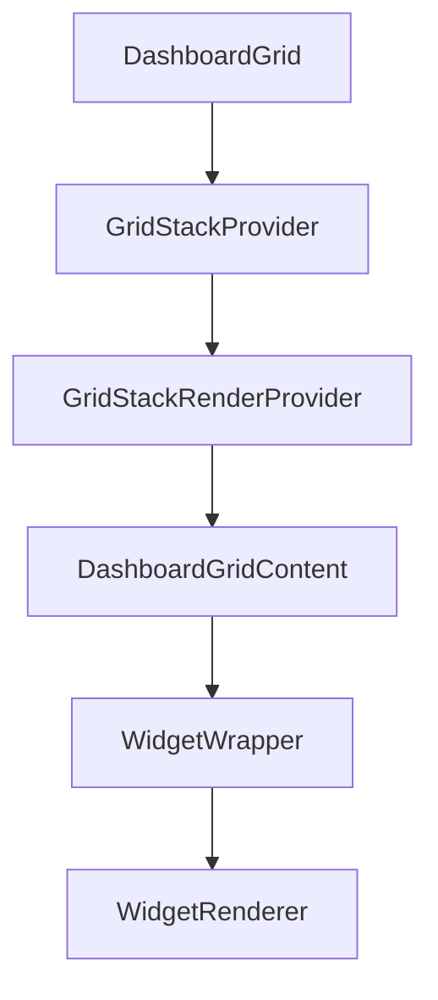

# Grid System

The dashboard layout is powered by **GridStack.js**, wrapped in React components for declarative usage.

## Architecture



---

## Core Components

### DashboardGrid
**Location:** `src/components/core/DashboardGrid.tsx`

The main grid component that wraps all widgets. Handles:
- Responsive breakpoint detection
- Edit mode toggle
- Layout change events

### GridStack Integration
**Location:** `src/gridstack-react/`

Custom React bindings for GridStack:

| File | Purpose |
|------|---------|
| `grid-stack-provider.tsx` | Initializes GridStack instance |
| `grid-stack-render-provider.tsx` | Renders widgets into grid cells |
| `grid-stack-context.ts` | React context for grid access |
| `grid-stack-widget-context.ts` | Per-widget context |

---

## Breakpoints

Defined in `src/constants/grid.ts`:

| Breakpoint | Columns | Rows | Description |
|------------|---------|------|-------------|
| `desktop` | 8 | 8 | Full-size screens |
| `tablet` | 4 | 16 | Tablets / smaller screens |
| `mobile` | 2 | 32 | Mobile devices |

---

## Widget Positioning

Each widget has a `GridPosition` object:

```typescript
interface GridPosition {
  x: number;  // Column position (0-indexed)
  y: number;  // Row position (0-indexed)
  w: number;  // Width in cells
  h: number;  // Height in cells
}
```

The grid enforces:
- Breakpoint-specific row limits (`8`, `16`, `32`)
- Widgets cannot overlap
- Auto-positioning finds first available slot

---

## Layout Persistence

Layout changes flow through the store system:

1. User drags/resizes widget in edit mode
2. GridStack fires `change` event
3. `DashboardGridContent` captures new positions
4. `useWidgetStore.updateLayout()` updates state
5. `usePersistenceStore.saveConfig()` persists to database

---

## Pages

Widgets are organized into pages:
- Each widget has a `pageId` linking to its page
- Pages can be reordered via `sortOrder`
- Scroll direction configurable (horizontal/vertical)
- Default page can be set per dashboard

---

## Edit Mode

When editing is enabled:
- Widgets become draggable and resizable
- Grid shows visual guides
- Layout variants are currently edited from desktop, with desktop preview targets for tablet and mobile
- Changes auto-save on toggle off
