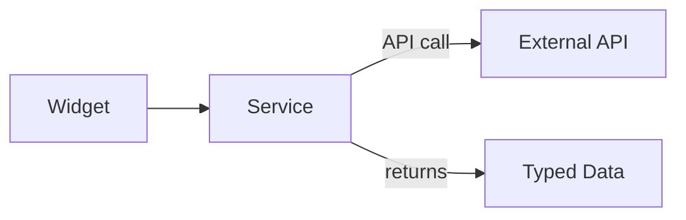

# Services Layer

The services layer (`src/services/`) provides a clean abstraction for external API calls used by widgets.

## Architecture



---

## Available Services

| Service | File | Description |
|---------|------|-------------|
| **Calendar** | `calendar.ts` | iCal feed parsing |
| **Jellyfin** | `jellyfin.ts` | Media library stats |
| **Jellyseerr** | `jellyseerr.ts` | Media request tracking |
| **Portainer** | `portainer.ts` | Docker container info |
| **qBittorrent** | `qbittorrent.ts` | Torrent download status |
| **RSS** | `rss.ts` | RSS/Atom feed parsing |
| **SABnzbd** | `sabnzbd.ts` | Usenet download stats |
| **Twitch** | `twitch.ts` | Stream status checks |
| **Weather** | `weather.ts` | Weather data (Open-Meteo) |

---

## Service Pattern

Each service follows a consistent pattern:

```typescript
// Example: weather.ts
export interface WeatherData {
  temperature: number;
  condition: string;
  // ...
}

export async function fetchWeather(
  latitude: number,
  longitude: number,
  unit: 'C' | 'F'
): Promise<WeatherData> {
  const response = await fetch(/* API URL */);
  const data = await response.json();
  return transformData(data);
}
```

---

## Integration with Widgets

Widgets call services with their configuration:

```typescript
// In a widget component
const { config, integrationId } = props;

const integration = useIntegrationStore(
  state => state.integrations.find(i => i.id === integrationId)
);

const data = await fetchServiceData({
  url: integration?.config.url || config?.url,
  apiKey: integration?.config.apiKey
});
```

---

## Proxy Routes

External API calls that require CORS handling or API key protection go through Next.js API routes:

| Route | Purpose |
|-------|---------|
| `/api/proxy/*` | Generic proxy for external services |
| `/api/weather` | Weather API with caching |
| `/api/calendar` | iCal feed fetching |

---

## Error Handling

Services handle errors gracefully:

```typescript
try {
  const data = await fetchData();
  return { success: true, data };
} catch (error) {
  console.error('Service error:', error);
  return { success: false, error: error.message };
}
```

Widgets display error states via `WidgetErrorBoundary`.

---

## Adding a New Service

1. Create `src/services/<name>.ts`
2. Define TypeScript interfaces for response data
3. Export fetch function(s)
4. Use in widget component
5. Add proxy route if needed for CORS/security
