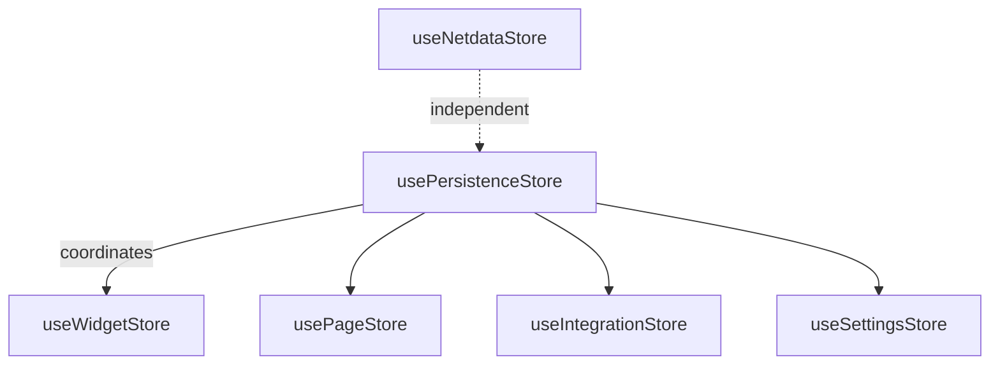
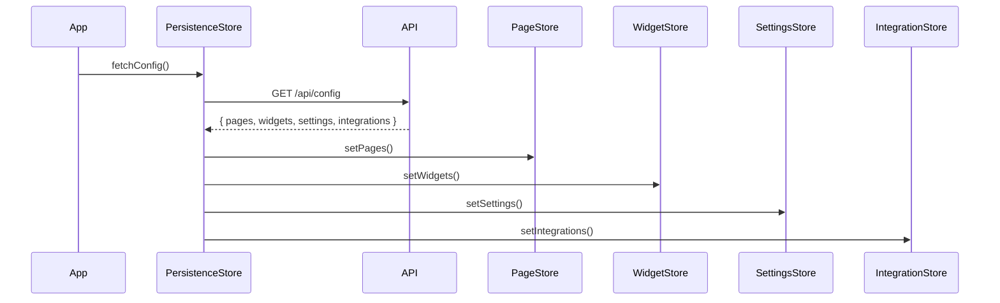
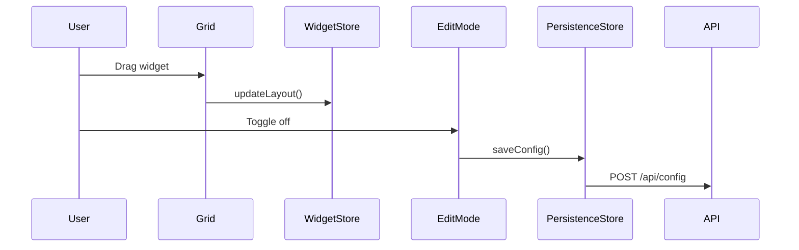

# State Management

The application uses **Zustand** for client-side state management with multiple specialized stores.

## Store Architecture

---

## Core Stores

### usePersistenceStore
**Location:** `src/store/usePersistenceStore.ts`

Central coordinator for loading and saving dashboard state.

| State | Type | Description |
|-------|------|-------------|
| `isLoaded` | boolean | Whether initial config has loaded |
| `isEditing` | boolean | Edit mode active |
| `canEditDashboard` | boolean | Current user has edit permissions |
| `saveStatus` | string | `'idle'` \| `'saving'` \| `'saved'` \| `'error'` |

| Action | Description |
|--------|-------------|
| `fetchConfig()` | Load dashboard from API |
| `saveConfig()` | Persist changes to API |
| `toggleEdit()` | Toggle edit mode |

---

### useWidgetStore
**Location:** `src/store/useWidgetStore.ts`

Manages widget collection and layout.

| Action | Description |
|--------|-------------|
| `setWidgets(widgets)` | Replace all widgets |
| `addWidget(newItem)` | Add a new widget |
| `updateWidget(id, updates)` | Update widget properties |
| `removeWidget(id)` | Delete a widget |
| `updateLayout(layout)` | Update positions after drag/resize |
| `getWidgetsByPage(pageId)` | Filter widgets by page |
| `findAvailablePosition()` | Find empty grid slot |

---

### usePageStore
**Location:** `src/store/usePageStore.ts`

Manages dashboard pages.

| State | Description |
|-------|-------------|
| `pages` | Array of page objects |
| `currentPageIndex` | Active page index |
| `scrollDirection` | `'vertical'` \| `'horizontal'` |
| `defaultPageId` | Default page on load |

---

### useSettingsStore
**Location:** `src/store/useSettingsStore.ts`

User preferences and app settings.

| Category | Settings |
|----------|----------|
| `behavior` | `refreshInterval`, `autoDetectLocation` |
| `display` | `is24Hour`, `temperatureUnit`, `timezone`, `city`, `rowHeight`, `gapSize`, `borderRadius` |
| `shortcuts` | Keyboard bindings for common actions |

---

### useIntegrationStore
**Location:** `src/store/useIntegrationStore.ts`

Manages saved integration configurations (API keys, URLs).

---

### useNetdataStore
**Location:** `src/store/useNetdataStore.ts`

Specialized store for Netdata widget data caching and refresh management.

---

## Data Flow

### Loading

### Saving

---

## Best Practices

- Stores are accessed via hooks: `const { widgets } = useWidgetStore()`
- Use selectors for performance: `useWidgetStore(state => state.widgets)`
- The persistence store coordinates saves to ensure consistency
- Widgets fetch their own data via services, not global state
