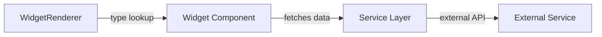

# Widget System

Widgets are the core building blocks of the dashboard. Each widget is a self-contained component with its own configuration and rendering logic.

## Available Widgets

### Integration Widgets
These widgets connect to external services:

| Widget | Description | Service |
|--------|-------------|---------|
| **Jellyfin** | Media library stats | Jellyfin/Emby |
| **Jellyseerr** | Media requests | Jellyseerr |
| **Portainer** | Container management | Portainer |
| **qBittorrent** | Download status | qBittorrent |
| **SABnzbd** | Usenet downloads | SABnzbd |
| **Netdata** | System monitoring | Netdata |
| **Twitch** | Stream status | Twitch API |

### Utility Widgets

| Widget | Description |
|--------|-------------|
| **Clock** | Time display (analog/digital) |
| **Weather** | Weather forecast |
| **Calendar** | iCal integration |
| **RSS** | Feed reader |
| **Search** | Search bar |
| **Image** | Static image display |
| **Shortcut** | Quick link to URL |
| **Spacer** | Empty space placeholder |

---

## Widget Structure

Each widget folder (`src/components/widgets/<name>/`) contains:

```
widget-name/
├── Widget.tsx           # Main component
├── Widget.module.css    # Scoped styles
├── WidgetConfig.tsx     # Configuration form
└── index.ts             # Exports
```

---

## Widget Interface

```typescript
interface Widget {
  id: string;           // Unique identifier
  type: string;         // Widget type name
  grid: GridPosition;   // Position and size
  name?: string;        // Display name
  pageId: string;       // Parent page
  config?: WidgetConfig; // Widget-specific settings
  integrationId?: string; // Linked integration
  syncConfig?: boolean; // Share config across users (default: true)
}
```

---

## Configuration System

Widgets use a form builder pattern for configuration:

```typescript
// Example from ClockConfig.tsx
const clockFields = [
  {
    type: 'select',
    name: 'variation',
    label: 'Clock Type',
    options: [
      { value: 'digital', label: 'Digital' },
      { value: 'analog', label: 'Analog' }
    ]
  },
  // ... more fields
];
```

---

## Rendering Pipeline



### WidgetRenderer
**Location:** `src/components/core/WidgetRenderer.tsx`

Maps widget types to components and handles:
- Dynamic component loading
- Error boundaries
- Loading states

### WidgetWrapper
**Location:** `src/components/core/WidgetWrapper.tsx`

Provides consistent styling and edit controls:
- Click-to-configure in edit mode
- Consistent border radius/shadows
- Error display

---

## Adding a New Widget

1. Create folder: `src/components/widgets/<name>/`
2. Create main component with props: `{ config, integrationId }`
3. Create config form using field builder
4. Export from `index.ts`
5. Register in `WidgetRenderer.tsx`
6. Add to widget type definitions
